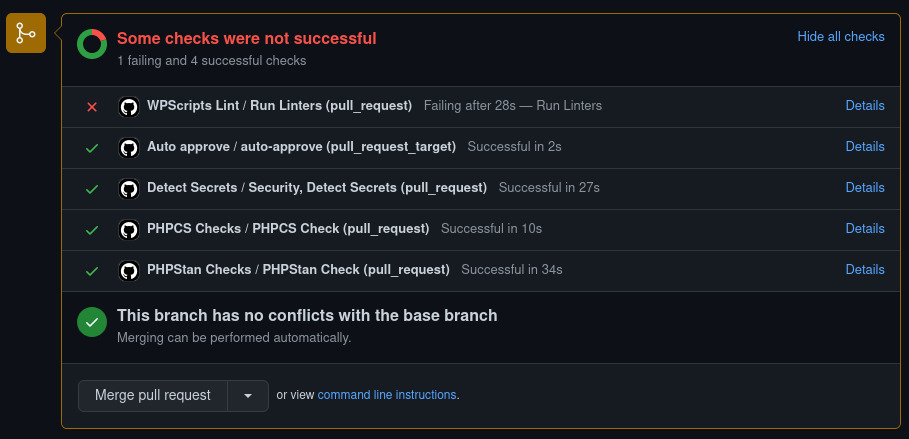
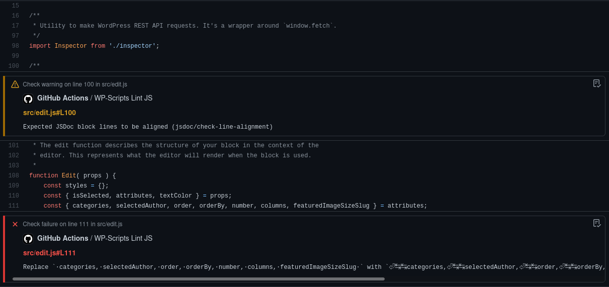

# ✨ WPScripts Lint Action

This is a WordPress linter action, specifically designed to work with **@wordpress/scripts** tool. Other Github linters don't work very well with WordPress configs, unless you do the trick with importing ESLint/Prettier/StyleLint configs manually. This action runs the command and outputs errors/warnings in a Github-friendly way.

- **Shows WP linting errors** on GitHub commits and PRs
- Allows **auto-fixing** issues
- Currently supports [lint-js, lint-style and lint-md-js](#supported-commands)

_**Note:** Not all linters are supported at the moment. Some of them don't support JSON output format. See [Limitations](#limitations)._

## Screenshots

- Checks on pull requests:

  

- Commit annotations:

  

## Supported commands

### lint-js

Helps enforce coding style guidelines for your JavaScript and TypeScript files. It uses [eslint](https://eslint.org/) with the set of recommended rules defined in [@wordpress/eslint-plugin](https://www.npmjs.com/package/@wordpress/eslint-plugin) npm package. By default, files located in ```build```, ```node_modules```, and ```vendor``` folders are ignored.

### lint-style

Helps enforce coding style guidelines for your style files. It uses [stylelint](https://github.com/stylelint/stylelint) with the [@wordpress/stylelint-config](https://www.npmjs.com/package/@wordpress/stylelint-config) configuration per the [WordPress CSS Coding Standards](https://developer.wordpress.org/coding-standards/wordpress-coding-standards/css/). By default lints CSS and SCSS files in the entire project’s directories. Files located in ```build```, ```node_modules```, and ```vendor``` folders are ignored.

### lint-md-js

Uses ESLint to lint the source included in markdown files to enforce standards for JS code. It uses [eslint-plugin-markdown](https://github.com/eslint/eslint-plugin-markdown) with the [.eslintrc-md.js](https://github.com/WordPress/gutenberg/blob/HEAD/packages/scripts/config/.eslintrc-md.js) configuration. This configuration tunes down the linting rules since documentation often includes just snippets of code. It is recommended to use the markdown linting as a check, but not necessarily a blocker since it might report more false errors.
## Usage

Create a new GitHub Actions workflow in your project, e.g. at `.github/workflows/lint.yml`. The content of the file should be in the following format:

```yml
name: WPScripts Lint

on:
  # Trigger the workflow on push or pull request,
  # but only for the main branch
  push:
    branches:
      - main
  pull_request:
    branches:
      - main

jobs:
  run-linters:
    name: Run linters
    runs-on: ubuntu-latest

    steps:
      - name: Check out Git repository
        uses: actions/checkout@v2

      # Install your linters here
      - name: Set up Node.js
        uses: actions/setup-node@v1
        with:
          node-version: 12

      # @wordpress/scripts must be in `package.json`
      - name: Install Node.js dependencies
        run: npm ci

      - name: Run linters
        uses: sixach/wpscripts-lint-action@v1
        with:
          # Enable your linters here
          lint_js: true
          lint_style: true
```

All linters are disabled by default. To enable a linter, simply set the option with its name to `true`, e.g. `lint_js: true`.

The action doesn't install the wp-scripts for you; you are responsible for installing it in your CI environment.

**Important:** Make sure to specify the `src` directory, for example:

```yml
- name: Run linters
  uses: sixach/wpscripts-lint-action@v1
  with:
    # Enable your linters here
    lint_js: true
    lint_js_args: ./src
    lint_style: true
    auto_fix: true
```

As the default `GITHUB_TOKEN` **cannot** be used to update workflow files due to the missing `workflow` permission. See [Limitations](#limitations).

## Configuration

### Linter-specific options

`[linter]` can be one of `lint_js`, `lint_style` and `lint_md_js`:

- **`[linter]`:** Enables the linter in your repository. Default: `false`
- **`[linter]_args`**: Additional arguments to pass to the linter. Example: `lint_js_args: "--max-warnings 0"` if Lint JS checks should fail even if there are no errors and only warnings. Default: `""`
- **`[linter]_dir`**: Directory where the linting command should be run. Example: `lint_js_dir: theme/` if Lint JS is installed in the `theme` subdirectory. Default: Repository root
- **`[linter]_extensions`:** Extensions of files to check with the linter. Example: `lint_js_extensions: js,ts` to lint JavaScript and TypeScript files with WPScripts Lint JS. Default: Varies by linter, see [`action.yml`](./action.yml)
- **`[linter]_command_prefix`:** Command prefix to be run before the linter command. Default: `""`.

### General options

- **`github_token`:** The `GITHUB_TOKEN` to [authenticate on behalf of GitHub Actions](https://docs.github.com/en/free-pro-team@latest/actions/reference/authentication-in-a-workflow#using-the-github_token-in-a-workflow). Defaults to the GitHub token.

- **`continue_on_error`:** Whether the workflow run should also fail when linter failures are detected. Default: `true`

- **`auto_fix`:** Whether linters should try to fix code style issues automatically. If some issues can be fixed, the action will commit and push the changes to the corresponding branch. Default: `false`

  <p align="center">
    
  </p>

- **`git_name`**: Username for auto-fix commits. Default: `"Lint Action"`

- **`git_email`**: Email address for auto-fix commits. Default: `"lint-action@sixa.ch"`

- **`git_no_verify`**: Bypass the pre-commit and pre-push git hooks. Default: `false`

- **`commit_message`**: Template for auto-fix commit messages. The `${linter}` variable can be used to insert the name of the linter. Default: `"Fix code style issues with ${linter}"`

- **`check_name`**: Template for the [name of the check run](https://docs.github.com/en/rest/reference/checks#create-a-check-run). Use this to ensure unique names when the action is used more than once in a workflow. The `${linter}` and `${dir}` variables can be used to insert the name and directory of the linter. Default: `"${linter}"`

- **`neutral_check_on_warning`:** Whether the check run should conclude with a neutral status instead of success when the linter finds only warnings. Default: `false`

### Linter support

Some options are not be available for specific linters:

| Linter                | auto-fixing | extensions |
| --------------------- | :---------: | :--------: |
| lint_js               |     ✅      |     ✅     |
| lint_style            |     ❌      |     ✅     |
| lint_md_js            |     ✅      |     ✅     |

## Limitations

### Pull requests

There are currently some limitations as to how this action (or any other action) can be used in the context of `pull_request` events from forks:

- The action doesn't have permission to push auto-fix changes to the fork. This is because the `pull_request` event runs on the upstream repo, where the `github_token` is lacking permissions for the fork. [Source](https://github.community/t5/GitHub-Actions/Can-t-push-to-forked-repository-on-the-original-repository-s/m-p/35916/highlight/true#M2372)
- The action doesn't have permission to create annotations for commits on forks and can therefore not display linting errors. [Source 1](https://github.community/t5/GitHub-Actions/Token-permissions-for-forks-once-again/m-p/33839), [source 2](https://github.com/actions/labeler/issues/12)

For details and comments, please refer to [#13](https://github.com/wearerequired/lint-action/issues/13).

### Auto-fixing workflow files

If `auto_fix` is enabled and the default `GITHUB_TOKEN` is used, none of the linters should be allowed to change files in `.github/workflows` as the token doesn't have the necessary `workflow` permission. This can be achieved by specifying the directory with source files as an argument for the used linter. [Source](https://github.community/t/github-linting-remote-rejected/121365)